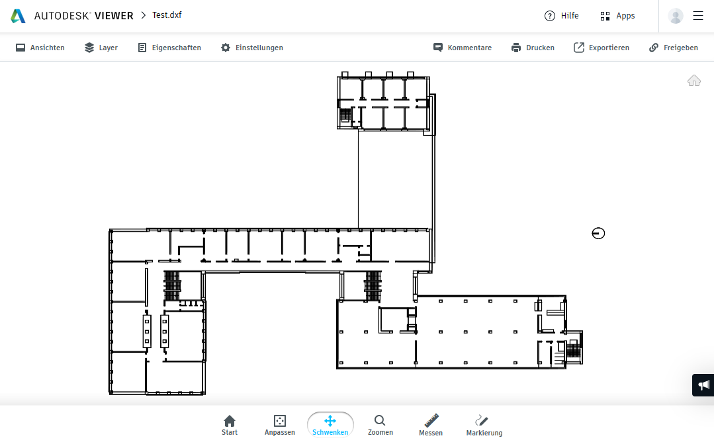
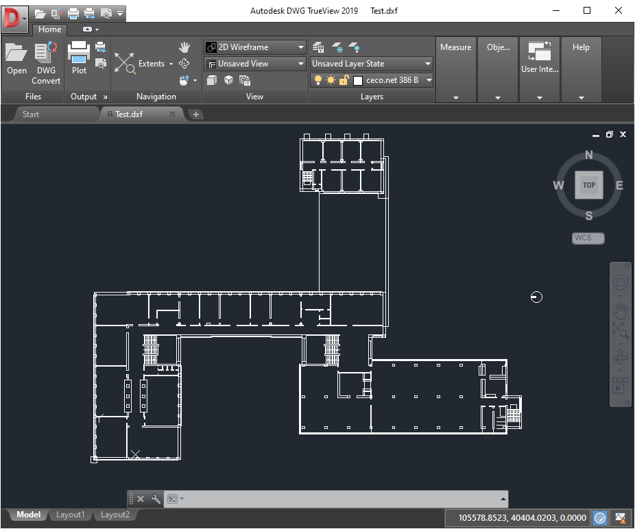
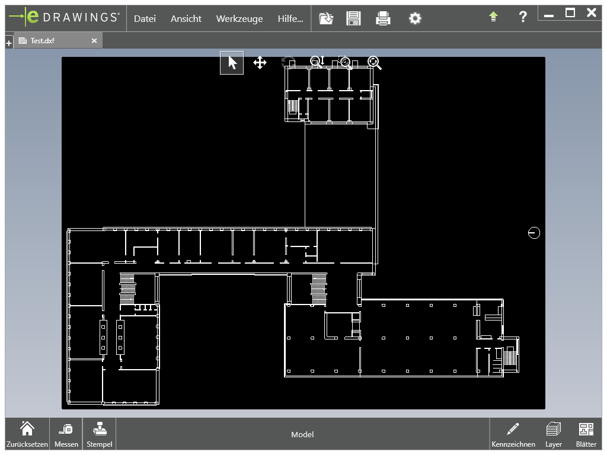
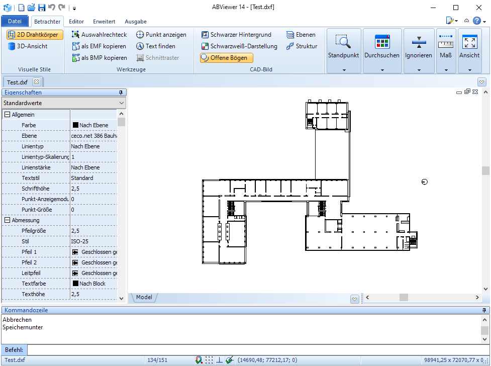

## Ausprobieren

Im Folgenden wollen wir die nachfolgend aufgelisteten, kostenlos verfügbaren, CAD-Viewer Programme ausprobieren.

- Autodesk Viewer
- DWG TrueView
- eDrawings Viewer
- ABViewer

Danach sollte eine Auflistung von Anforderungen möglich sein, die - neben den bereits gegebenen Anforderungen - für das neue Visualisierungswerkzeug für Gebäudepläne sinnvoll erscheinen.

### Autodesk Viewer

Das Programm Autodesk Viewer vom ursprünglichen Entwickler des DXF-Formats Autodesk (https://images.autodesk.com/adsk/files/autocad_2012_pdf_dxf-reference_enu.pdf)
ist eine web-basierte Lösung zur Ansicht von CAD-Dateien (https://viewer.autodesk.com).
Zur Verwendung reicht ein Browser und ein Aufruf von https://viewer.autodesk.com sowie ein vorhandenes Benutzerkonto bei Autodesk.

Die Dateien zur Ansicht müssen dort hochgeladen werden.
Danach kann im Beispielgebäudeplan per Maus navigiert werden (Mausrad zum Anpassen des Maßstabs, Ziehen mit der Maus zum Verschieben).
Des Weiteren stehen Funktionen zum Messen zwischen verschiedenen Punkten und zum Markieren einer bestimmten Stelle oder eines Bereichs zur Verfügung.
Außerdem kann der Anwender den geöffneten Gebäudeplan im Rastergrafikformat PNG herunterladen.
In der resultierenden PNG-Dateien befinden sich auch alle vorgenommenen Markierungen und Messungen.

### DWG TrueView

DWG TrueView ist wie Autodesk Viewer ein Produkt vom Hersteller Autodesk.
Im Gegensatz zu Autodesk Viewer ist jedoch eine Installation des Programmes notwendig, dessen Setup-Programm aktuell eine Dateigröße von über einem halben Gigabyte besitzt.
Zur Installation sind weitere 1,42 Gigabyte notwendig.
Laut einer Vergleichsseite von Autodesks Viewerprogrammen unter https://www.autodesk.de/viewers/all-viewers/compare unterscheidet sich das Programm von Autodesk Viewer nur unwesentlich und unterstützt weniger Dateiformate.

Vom Featureumfang unterscheidet es sich zu Autodesk Viewer lediglich durch eine Option zwischen verschiedenen DWG Versionen zu konvertieren (Autodesks proprietäres CAD-Dateiformat).

### eDrawings Viewer

Der eDrawings Viewer (https://www.edrawingsviewer.com/) ist ein weiteres Viewer-Programm für CAD-Dateien.
Es ist ebenfalls eine lokale Installation der Anwendung notwendig.

Die Anwendung ist vom Featureumfang wieder sehr ähnlich zum Autodesk Viewer oder DWG TrueView.
Es gibt Funktionen durch den Gebäudeplan zu navigieren (Zoom & Pan), Messungen vorzunehmen und Bereiche zu markieren.

### ABViewer

ABViewer ist ein weiteres Produkt zur Anzeige von CAD-Dateien, welches nach lokaler Installation verwendet werden kann (https://cadsofttools.de/products/abviewer).
Wir finden wieder die klassischen Elemente, wie auch bei den bereits betrachteten Programmen: Pan & Zoom, Messungen und Markierungen.

### Zusammenfassung

Die betrachteten Programme weisen wenig spannende Unterschiede auf, lediglich Autodesk Viewer ist web-basiert und fällt daher auf.
Vom Funktionsumfang sind alle vier Anwendungen sehr ähnlich.
Das macht es uns leicht Anforderungen für das neue Visualisierungstool für Gebäudepläne zu konstruieren.

Zusammenfassend finden sich drei Funktionen, die in jedem der ausprobierten Viewer zur Verfügung stehen:
- Pan & Zoom
- Messen
- Markieren

Davon erscheint lediglich **Pan & Zoom der Arbeitsfläche** als sinnvoll für unsere Anwendung, um auch in großen und komplexen Gebäudeplänen navigieren zu können.
Diese neue Anforderung bildet zusammen mit den bereits gegebenen Anforderungen eine gute Basis für die weitere Entwicklung der Anwendung.
